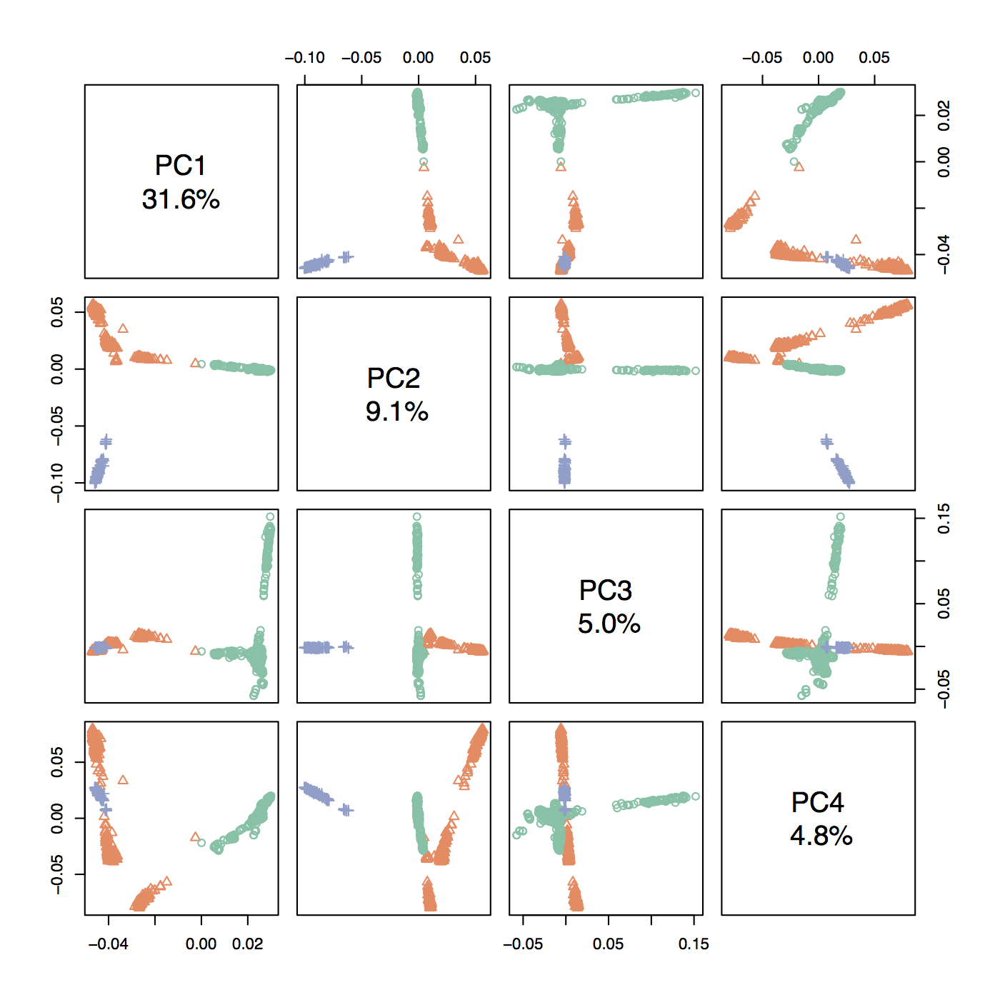

# Global ancestry of the merged dataset
The global ancestry analyses include a PCA, ADMIXTURE analysis, and three population test.  Prior to doing these analyses, I also built a "cluster" file that is needed, especially for plotting.  The format for this file is simply three columns: FID   IID   POP.  I assigned all samples to three possible 'pops', MexWolf, GrayWolf, and Dog.  
You can access this file here:
[Canine cluster file](./Data/canine.cluster)

## LD Prune dataset
Here we prune the 118287 SNP merged dataset for SNPs in high LD.  We use the R package (in bioconductor) [SNPRelate v0.9.18](http://bioconductor.org/packages/release/bioc/html/SNPRelate.html).  Pruning utilized a 1 MB window sliding window, and removing one from each pair of SNPs if the r > 0.5.

```R
# Load library
library(SNPRelate)

# Convet to gds file
bed.fn = "MERGED.clean.bed"
bim.fn = "MERGED.clean.bim"
fam.fn = "MERGED.clean.fam"
snpgdsBED2GDS(bed.fn, fam.fn, bim.fn, "MERGED.clean.gds")

# Open GDS file for pruning
genofile = openfn.gds("MERGED.clean.gds")


# Get sample IDs
samp.id <- read.gdsn(index.gdsn(genofile, "sample.id"))

# LD Prune 
snps2keep = snpgdsLDpruning(genofile, autosome.only = F, method = "r", slide.max.bp = 1000000, verbose = T, ld.threshold = 0.5, sample.id = samp.id)
   # 74876 SNPs are selected in total.

# Get a list of of the SNPs retained
snps.id = unlist(snps2keep)

# Save pruned dataset
snpgdsGDS2BED(genofile, bed.fn = "MERGED.clean.pruned", snp.id = snps.id)
```
After LD pruning, 74876 SNPs remained.  If repeated, this number does vary slightly due to stochasticity in the analysis. Also, SNPRelate alters the fam file output, so we overwrite it using the old fam file:

```bash
cp MERGED.clean.fam MERGED.clean.pruned.fam
```

## PCA Analysis
Here we construct a PCA for the Merged dataset again using SNPRelate.  The R code below continues from where we left off.

```R
# Make sure the library is loaded
library(SNPRelate)

# PCA (limited to the retained SNPs (not in LD)
pca = snpgdsPCA(genofile, autosome.only=  FALSE, snp.id = snps.id, sample.id = samp.id)
pc.percent <- 100 * pca$eigenval[1:32]/sum(pca$eigenval, na.rm = T)

# Plot Principle components (published in the article)
pdf("Merged-PCbars.pdf", width = 9, height = 7)
barplot(pc.percent[1:20], las = 1, ylab = "Percent Variation", xlab = "Principle Component", names.arg = c(1:20), ylim = c(0,15), axis.lty = 1)
dev.off()

# Read in the canine cluster file for plotting
pops = read.table("canine.cluster", header = F)

# Plot pairwise PCA for first 4 components, only save as a pdf if needed later
lbls <- paste("PC", 1:4, "\n", format(pc.percent[1:4], digits = 2), "%", sep = "")
palette(c("#66c2a5", "#fc8d62", "#8da0cb", "#e78ac3"))
pairs(pca$eigenvect[,1:4], col = as.factor(pops$V3), labels = lbls, pch = as.numeric(pops$V3))
dev.copy(pdf, "Merged-pairs-PCA.pdf", height = 4.5, width = 3.5)
   # Dog = green = circles
   # GrayWolf = orange =triangles
   # MexWolf = blue = crosses

# Make PCA Plot (published in the article)
pdf("MERGED.pca.pdf")
plot.new()
plot.window(xlim = c(min(pca$eigenvect[,1]), max(pca$eigenvect[,1])), ylim = c(min(pca$eigenvect[,2]), max(pca$eigenvect[,2])))
axis(1)
axis(2, las = 2)
box()
points(pca$eigenvect[,1], pca$eigenvect[,2], pch = as.numeric(pops$V3), col = as.factor(pops$V3))
title(xlab = "PC 1 - 13.2%", ylab = "PC 2 - 3.8%")
legend("topright", legend = c("Dog", "Gray Wolf", "Mexican Wolf"), col = c(1:3), pch = c(1:3), bty = 'n')
dev.off()
```

The main PCA and barplot are published in the manuscript.  The paired PCA plot for the first 4 principle components can be found below:

    - Dog = green = circles
    - GrayWolf = orange = triangles
    - MexWolf = blue = crosses




